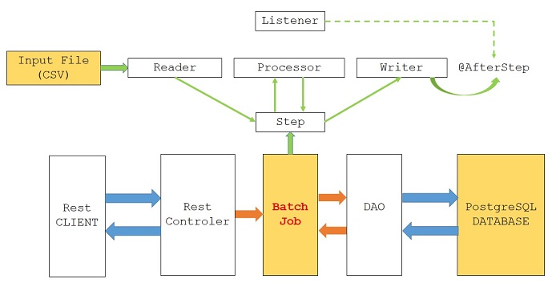

# BoaVistaBatch

Colab da limpeza dos dados
https://github.com/GCPBigData/BoaVistaBatch/blob/main/BoaVista.ipynb

Github do projeto Scala Spark
https://github.com/GCPBigData/BoaVista

 ##Arquitetura Usada no Projeto Java

 

 #GCP -  Criar uma instância, Postgres 
    
    1 -  Acesse a página "Instâncias" do Cloud SQL no Console do Google Cloud.
    2 -  Selecione o projeto e clique em Continuar.
    3 -  Clique em Criar instância.
    4 -  Clique em PostgreSQL.
    5 -  Insira myinstance para o ID da instância.
    6 -  Insira uma senha para o usuário postgres.
    7 -  Use os valores padrão dos outros campos.
    8 -  Clique em Criar.

# Conecte-se à sua instância usando o cliente psql no Cloud Shell

    1 - No Console do Google Cloud, clique no ícone do Cloud Shell (Ícone do Cloud Shell) no canto superior direito.
        Quando a inicialização do Cloud Shell terminar, aparecerá o seguinte:

             Welcome to Cloud Shell! Type "help" to get started.
             username@example-id:~$

    2 -  No prompt do Cloud Shell, conecte-se à instância do Cloud SQL:
  
       gcloud sql connect myinstance --user=postgres

    3 -  Insira a senha do postgres.

# Criar um banco de dados
  
     1 - Crie um banco de dados SQL na sua instância do Cloud SQL:

              CREATE DATABASE boavista;

# Cree una instancia de máquina virtual
    https://cloud.google.com/compute/docs/quickstart-linux?hl=es-419

#Baixe o Projeto Java
  
    1 - git clone https://github.com/GCPBigData/BoaVistaBatch
    2 - ./mvnw spring-boot:run
    3 - http://seu ip externo:8080/ExecutarJob
    OBS: Quando terminar o carregamento, mostra uma mensagem.

#Como verificar o status do pipeline

    1 - Acesse o Console do Google Cloud.
    2 - Selecione seu projeto do Google Cloud na lista de projetos.
    3 - Clique no menu no canto superior esquerdo.
        Navegue até a seção Big Data e clique em Dataflow. No painel do lado direito, será exibida uma lista de jobs em execução.
        Selecione o job de pipeline que quer visualizar. Será possível ver os status dos jobs no campo Status: "Em execução", "Finalizado" ou "Com falha".

      
  

  
 

